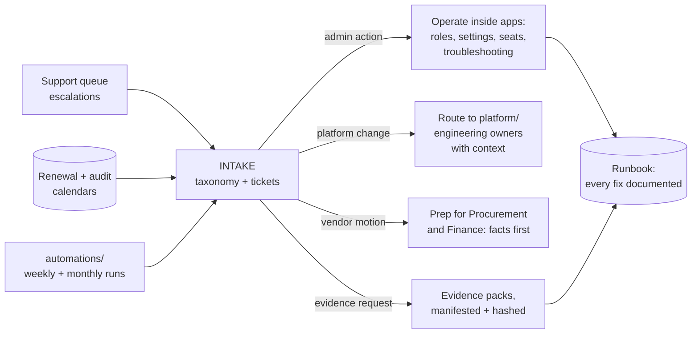

# saas-ops-from-scratch

The operating model for a company's SaaS estate, built from scratch: the intake
taxonomy, the renewal calendar, the audit-evidence motion, the hygiene
automations, and the 30/60/90 plan for standing the lane up. Everything here
runs: five Python automations (standard library only) execute against a
fixture estate with zero API keys, gated by CI on every push.

This is the operational counterpart to my other repos: where
[okta-as-code](https://github.com/emiliorobles24/okta-as-code) covers the
identity lifecycle and [endpoints-as-code](https://github.com/emiliorobles24/endpoints-as-code)
covers the device fleet, this one covers the layer most companies run on
spreadsheets and memory: **the applications themselves**: who has seats, what
they cost, when contracts renew, what auditors need, and how sprawl is kept
honest. I ran this lane in production for years; this repo is that experience
written down as a system someone else could operate.

## The lane, in one diagram



The line that makes the whole thing work: **know when a request crosses from
operating a system into changing it**, and route platform-level work to the
team that owns it, with context attached. Admin work stays fast because
platform work goes to the right place.

## What's in here

```
saas-ops-from-scratch/
├── runbook/
│   ├── intake.md              # The taxonomy, the operate-vs-change boundary,
│   │                          # governance-at-creation (the intake-form pattern)
│   ├── renewal-calendar.md    # T-90/T-60/T-30 cadence, notice deadlines,
│   │                          # the monthly utilization review
│   ├── audit-evidence.md      # Evidence as a repeatable, verifiable motion
│   └── handoff.md             # The follow-the-sun handoff: shift notes, severity
│                              # carryover, and the coverage matrix
├── automations/
│   ├── seat_report.py         # Utilization across the estate + reclaim candidates
│   ├── renewal_radar.py       # Renewal windows + notice deadlines + true-up prep
│   ├── evidence_pack.py       # Evidence packs with SHA-256 manifests
│   ├── groups_hygiene.py      # Google Groups: nesting, owners, external reach,
│   │                          # and the register check (provenance for every group)
│   └── slack_app_audit.py     # App installs: credential age, orphans, broad scopes
├── fixtures/                  # A small fictional company's estate, so everything
│                              # runs keyless, here and in CI
└── checks.py                  # The CI gate: all five automations, pinned date,
                               # asserted findings
```

## The principles the lane runs on

1. **Operate vs change.** Admin actions inside configured apps are this lane's
   job, done same-day. Identity plumbing, integrations, and platform config
   belong to their owners; route with context, never touch heroically.
2. **The third repeat becomes automation.** Deterministic scripts first,
   app-native workflows second, AI-assisted tools where ambiguity is the
   problem and a wrong answer is cheap. That ordering is a safety posture,
   not a style preference.
3. **Governance at creation time, not archaeology later.** Anything that can
   sprawl (groups, apps, integrations) gets an intake form recording purpose,
   lifecycle, and owner, feeding a register the automations check forever
   after. I ran exactly this in production for Google Groups: an owner-by-owner
   cleanup once, then a required intake form so the cleanup never needed
   repeating.
4. **Calendars and queues coexist by design.** Renewals and audits are
   calendar work; escalations are queue work; the radar scripts exist so
   neither steals attention from the other and nothing is discovered late.
5. **Facts before negotiations.** The lane never decides spend; it makes sure
   whoever does walks in with utilization truth. A license audit run this way
   funded itself many times over in production.
6. **Evidence-side discipline.** Audit scope and control ownership live with
   Security and Compliance; this lane makes their evidence painless,
   manifested, and reproducible.
7. **Everything ships a runbook.** A fix that lives in one person's head
   leaves when they do.
8. **Least-privilege credentials for every automation**: per-platform
   read-only tokens, encrypted secrets, pre-expiry alerting. An automation
   estate is a fleet of non-human identities and deserves the same lifecycle
   discipline as the human ones.

## The values under the hood

The principles above are the HOW. These are the WHY: commitments borrowed from
the companies doing the most serious work on operating AI safely, translated
into what they mean for an IT operations lane. Each one is enacted somewhere
concrete in this repo, not just claimed.

| Commitment | What it means in this lane | Where it's real |
|---|---|---|
| **Hold optimism and risk at once** | Adopt AI aggressively where wrong answers are cheap; govern it strictly where they aren't. Enthusiasm and guardrails are the same posture, not opposites | The AI ordering in [SAFETY.md](SAFETY.md); the deterministic-first principle above; the [field guide](FIELD-GUIDE.md) keeping vendor contradictions instead of averaging them away |
| **Be good to your users** | "Users" defined broadly: the person with the ticket, the teammate covering the lane next, the auditor pulling evidence, anyone the systems touch. Plain language, no acronym walls, nobody made to feel dumb for asking | The intake taxonomy's user-facing design; the enablement-first migration pattern; every runbook written for the next reader |
| **Make the safe path the easy path** | Governance wins by being more convenient than the workaround, never by decree. If the intake form is slower than a credit card, sprawl wins | Governance-at-creation intake forms; the vetted self-service catalog pattern; the register the automations check forever after |
| **Do the simple thing that works** | Boring, auditable, standard-library solutions before clever ones: a bicycle when a bicycle is what's needed, never a spaceship. A deterministic script anyone can read beats an impressive system nobody can debug | Every automation here: stdlib Python, fixtures, one ingestion function, CI-gated |
| **Helpful, honest, harmless** | Helpful: deflect work only when it's truly resolved. Honest: strict-definition metrics, published even when unflattering. Harmless: least privilege, read-only by default, blast radius named before every change | The strict deflection definition; the Autonomy Levels; the read-only credential pattern in [okta-as-code's CLI](https://github.com/emiliorobles24/okta-as-code/tree/main/cli) |
| **No bystanders** | If it urgently needs doing and it's in this lane, the right person is probably you: same-day, no ticket ping-pong. If it belongs to another owner, it's routed WITH context and followed until landed, never dropped between teams | The operate-vs-change boundary in [`runbook/intake.md`](runbook/intake.md): fast ownership on one side, accountable routing on the other |

## The 30/60/90: standing the lane up from day one

> The full four-quarter version, day 1 through month 12, with the JD-by-JD fit
> map: **[FIRST-YEAR-PLAN.md](FIRST-YEAR-PLAN.md)**. The evidence behind it, how
> GitLab, Adobe, Spotify, Block, and the frontier labs actually run this lane,
> with vendor bias flagged and contradictions kept: **[FIELD-GUIDE.md](FIELD-GUIDE.md)**.
> And how the lane changes things without breaking them, including the Autonomy
> Levels every automation must climb before it may act: **[SAFETY.md](SAFETY.md)**.

**Days 1-30: learn the estate, write nothing clever.**
Inventory every app, owner, contract, and admin credential. Shadow the support
queue and tag every escalation with the intake taxonomy. Build the renewal
calendar from the contracts (data first, radar later). Run the first
seat-utilization report by hand to learn where the data lives. Meet the
platform/engineering owners and agree the operate-vs-change boundary out loud.

**Days 31-60: make the calendar and the reports run themselves.**
Stand up the radar and the monthly utilization review. First reclaim
conversations (managers, not surprises). Dry-run an evidence pack against the
last audit's request list and fix the gaps it finds. Baseline groups and
Slack-app hygiene; open the intake form for anything that can sprawl.

**Days 61-90: the lane runs on rails, and the runbook proves it.**
The top-ten request classes have runbook entries. The first real renewal goes
through the T-90/T-60/T-30 cadence end to end. Reclamation is a monthly
rhythm with numbers attached. Someone else could cover the lane for a week
from the runbook alone, which is the actual test of whether it's a lane or
just a person.

## Running it

```
python3 automations/seat_report.py    --as-of 2026-08-26
python3 automations/renewal_radar.py  --as-of 2026-08-26
python3 automations/evidence_pack.py  --as-of 2026-08-26 --out /tmp/pack
python3 automations/groups_hygiene.py --as-of 2026-08-26
python3 automations/slack_app_audit.py --as-of 2026-08-26
python3 checks.py   # the CI gate
```

Zero keys, zero dependencies: the fixture estate is a small fictional company
with exactly the problems these tools exist to find. Real-mode wiring is
documented in each script's docstring; the report logic never changes, which
is the point of keeping ingestion behind one function.

## Honest scope

This is a design-and-demonstration repo: real automation logic, real operating
cadences from production experience, pointed at fixture data rather than a
live estate. The practices are ones I ran at a 1,000+ person public SaaS
company (license audits and reclamation, renewal prep, SOC 2 evidence cycles
on the evidence side, the Google Groups intake-form governance); the code here
is the reusable expression of them, built to be picked up and pointed at real
vendor APIs one loader at a time.
